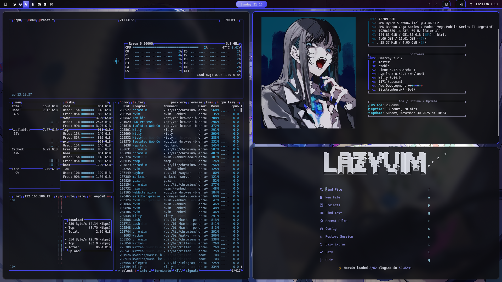
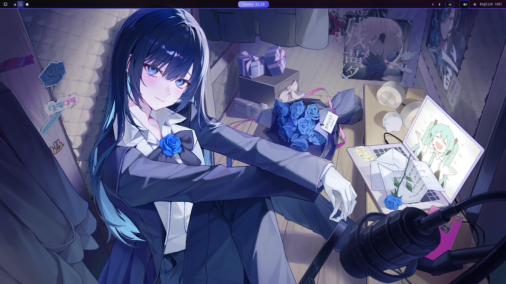
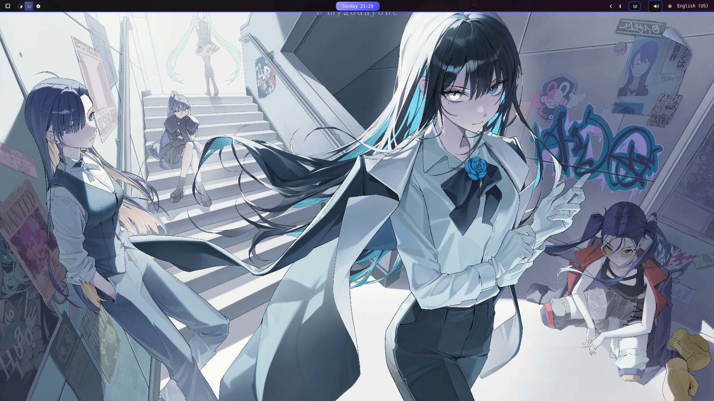
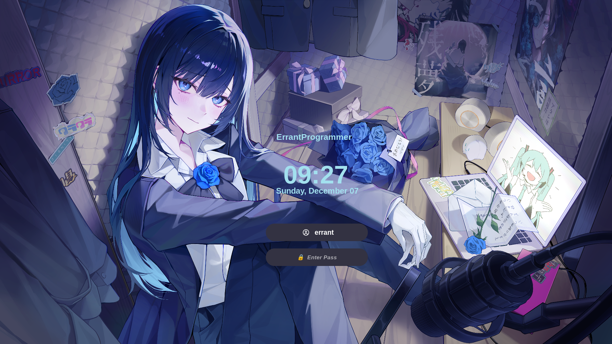
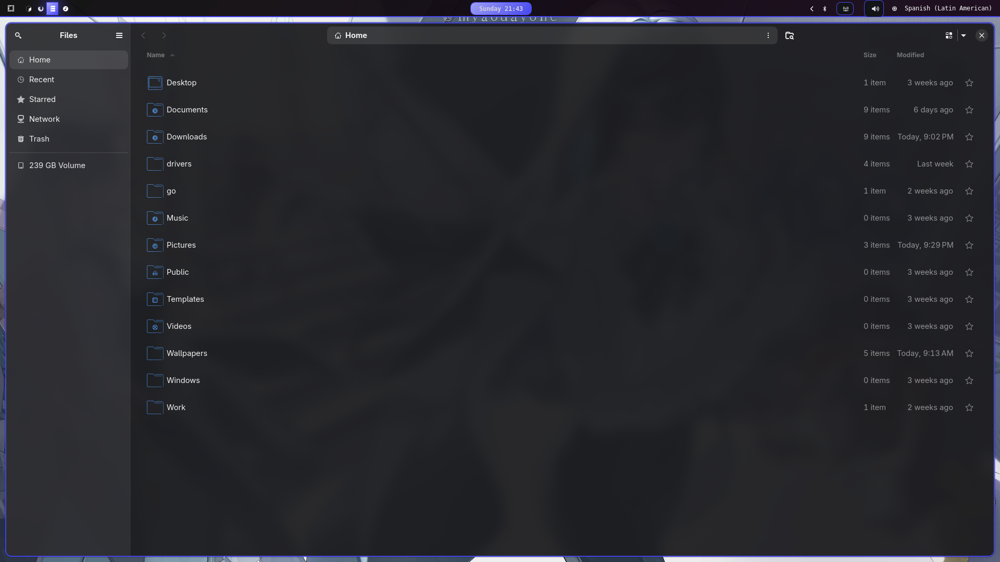

# Omarchy Ado Theme

***Language***

- [🇵🇪 Español](./README.es.md)
- 🇺🇸 English

This is the Ado theme for [Omarchy.org](https://omarchy.org), inspired by the color palette used in their profile picture.

  

## Key Colors

| Use           | Code  | RGBA                     | Name           |
| ------------- | ------- | ------------------------ | ---------------- |
| background    | #0D0D0F | rgba(13, 13, 15, 1.0)    | Woodsmoke        |
| foreground    | #DFDEE6 | rgba(223, 222, 230, 1.0) | Faded white      |
| Black         | #333242 | rgba(51, 50, 66, 1.0)    | Tuna             |
| Red          | #903034 | rgba(144, 48, 52, 1.0)   | Light Carmine    |
| Green         | #014761 | rgba(1, 71, 97, 1.0)     | Astronaut Blue   |
| Yellow      | #8BB0C6 | rgba(139, 176, 198, 1)   | Metallic Glacier |
| Blue          | #4545F5 | rgba(69, 69, 245, 1.0)   | Neon Blue        |
| Magenta       | #25516A | rgba(37, 81, 106, 1.0)   | Polynesian Blue  |
| Cyan          | #45C1DD | rgba(69, 193, 221, 1.0)  | Mosaic Blue      |
| White        | #DAD8E3 | rgba(218, 216, 227, 1.0) | Pure Silcon      |
| Black gray   | #908EAA | rgba(144, 142, 170, 1.0) | Cool Gray        |
| Bright red     | #D7878B | rgba(215, 135, 139, 1.0) | Vintage Rose     |
|  Bright green  | #33C6FC | rgba(51, 198, 252, 1.0)  | Highlighter blue |
| Bright yellow| #7DC0D3 | rgba(125, 192, 211, 1)   | Santas Gray      |
|  Bright blue   | #A2A2FA | rgba(162, 162, 250, 1.0) | Bright Ube       |
|  Bright magenta | #76AFCF | rgba(118, 175, 207, 1.0) | Iceberg          |
|      Bright cyan| #A2E0EE | rgba(162, 224, 238, 1.0) | Angelina         |
|    Bright white| #ECEBF1 | rgba(236, 235, 241, 1.0) | Bright Grey      |

## Preview

  
  

### Hyprlock

  

## System dependencies

I use the following [icons](https://www.pling.com/p/1493433)

  

## Applications used

The following [website](https://www.color-name.com/tools/color-name-from-image) was used to detect the colours in Ado's profile photo.

## Next Steps

- [ ] Finish configuring the colours for neovim
